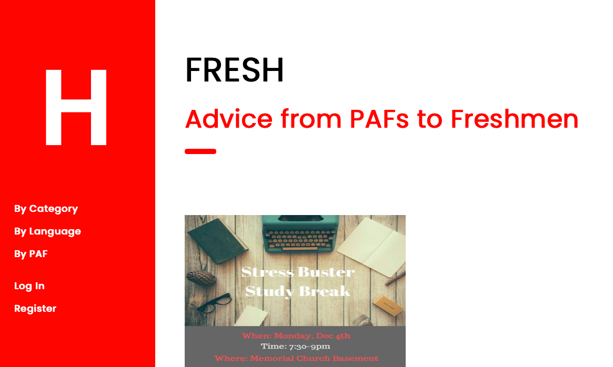
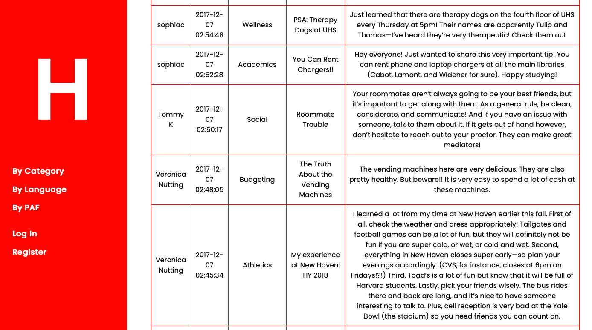
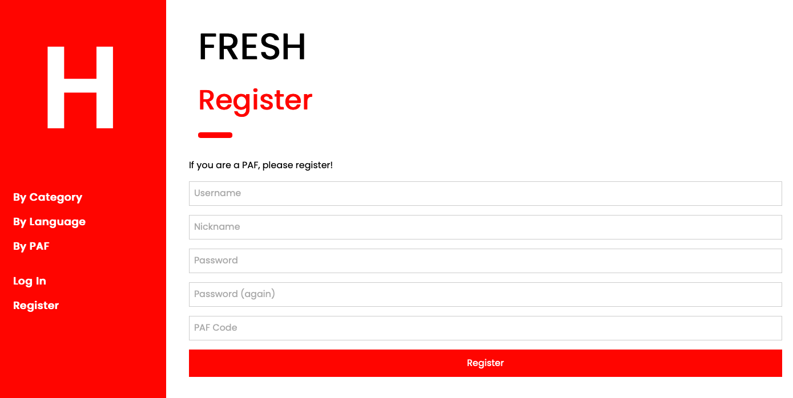

# Advice from PAFs to Freshmen

[Link](https://fresh50.herokuapp.com) to project website

Created by [Sophia Clark](https://github.com/sophiac15) and [Veronica Nutting](https://github.com/veronicanutting)

**About the Project:**

The Fresh Guide acts as a platform where PAFs can post advice catered to freshman. The website, which is deployed via Heroku,
is written mainly in Python and HTML with some Jinja. While some features require having logged in, the posts and events pages
are available to the public. Although the website is designed for Harvard, it could serve as a template for similar platforms
in other instituions and communities seeking to consolidate, organize, and expertly display information.

The website's home page features a side-bar on the left side and displays event flyers ordered by most recent first. These images
were taken from FDO emails about student events. Everyone can view these images, but
only logged-in users can post (more about this later). The large "H" in the upper left-hand corner acts as the home screen button.
The first three categories in the side-bar below the "H" are "By Category," "By Language," and "By PAF" are visible to all users,
logged in or not, in that order. When clicked, these items link to pages with forms. In each of these forms, the user can specify
which posts they want to see. The "See Posts" buttons submit the forms which then link to pages diplaying tables with the relevant
posts. Since the form options are selected from all possibilities, there may be cases in which there are no posts yet that fit
the requested specifications. For instance, in "By PAFs," the nickname of every registered PAF/administrator is displayed, independent
of whether or not they have posted anything. So a user could select a PAF that has not yet posted anything--this would result in
an error message explaining as much. This decision, to present all of the options, is meant to reflect the breadth of the website's
broader goals. Even if there aren't posts by every PAF at some time, we hope that eventually all registered PAFs will eventually
think of advice to post.

This is the extent of the website for students and other non-PAF/non-administrator users. The register, log-in, and logout processes
of the website are based on the CS50 Staff implementations of PSET 7 ("Finance"). Fresh similarly stores new user information
(hashing their passwords, remembering who has logged in, and checking that usernames are unique in the same ways). In addition to
these elements, during the register process, Fresh requires that users insert a "nickname," which will be diplayed in place of their
username along with their posts, and a "PAF Code" ("Fre5h50!"). Although in this prototype this code was singularly-generated, future versions might include more sophisticated forms of code protections ensuring that users seeking to register are indeed Harvard PAFs or
administrators. (Duo-Mobile/Harvard-Key log-in, which is used to protect many Harvard-specific websites, does let people apply to
use their services. This might prove to be an effective way to check that users are PAF-certified upperclassmen, FDO staff members,
or other relevant administrators.)

"Log in" and "Register" sit further down on the sidebar and are visible to all users not logged in. Once logged in, users will instead
see "My Posts," "Post Advice," "Add Event," "Usage Statistics," and "Logout," the most straight-forward of them all. When clicked,
"My Posts" displays a table with all of the posts that the logged-in user has posted, ordered by most recent first. "Post Advice,"
when clicked, goes to a form that the user to input information about their post. Once the user has inputted "Title" and "Advice,"
the form can be submitted. (If the user does not "select" a language or category to identify their post, then it will simply be
stored as "English" and "Academics.") Upon successful submission, a page appears displaying the information the user just submitted.
"Add Event" is a feature designed with the FDO in mind, for them to post the flyers they often email to the freshmen advertising
social, educational, and generally fun events. When clicked, it takes the user to a form which asks for a url and a description. In
the case that the url is invalid, the post can still be stored and will be diplayed. In the place of the image, however, will be
an image of the website's creators with text informing viewers that the url was invalid. After an event has been added, a page will
appear displaying the posted event. Finally, "Usage Statistics" displays information about how Fresh is being used. Specifically,
it lists the total number of posts and events, as well as the number of PAFs that have posted and the number of languages/
categories with posts associated with them. These figures are specifically picked so as to best reflect to what extent the community
is using the website. (For instance, it is not very useful to know that 50 PAFs have registered on Fresh if only 5 of them have
actually ever posted anything.)

All of the above functions and features can be found in application.py and templates/. Apology from Helpers.py was adapted and is now
"Uh Oh," featuring an image of the website's creators (looking apologetic/sympathetic). It functions for the most part as does
Apology.

In terms of databases, as in PSET 7, phpLite and SQL queries are used. The information in the Categories and Languages tables is
static and must be inserted manually once. (Another version of this might include a feature for PAFs/administrators to add categories
or languages as they see fit.)
